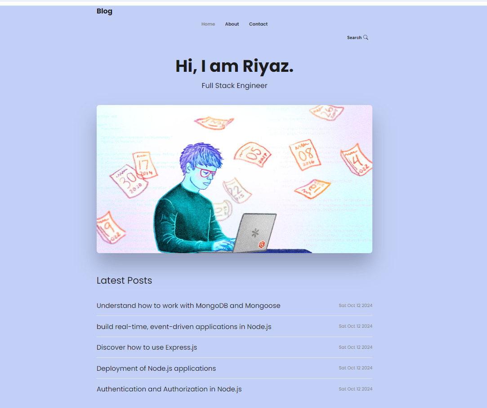

# Node.js, Express, EJS & MongoDB Blog - CRUD



## Overview

This project is a simple blog application built using Node.js, Express, EJS, and MongoDB. It allows users to perform CRUD (Create, Read, Update, Delete) operations on blog posts. The application features user authentication using JWT (JSON Web Tokens).

## Prerequisites

To run this application, you will need:

- **Node.js**: Ensure you have Node.js installed on your machine. You can download it from [Node.js official website](https://nodejs.org/).
- **MongoDB**: A free MongoDB cluster. Sign up for a free database cluster on [MongoDB Atlas](https://www.mongodb.com/cloud/atlas).

## Setup Database

1. **Sign Up for MongoDB Free Database Cluster**:

   - Visit [MongoDB Atlas](https://www.mongodb.com/cloud/atlas) and create an account.
   - Create a new cluster and follow the instructions to set up your database.

2. **Create a `.env` file**:

   - Create a file named `.env` in the root of your project directory to store your database credentials and other secrets.
   - Add the following lines to your `.env` file, replacing `<username>`, `<password>`, and `clusterName` with your actual MongoDB credentials:

   ```plaintext
   MONGODB_URI=mongodb+srv://<username>:<password>@clusterName.xxxxxxx.mongodb.net/blog
   JWT_SECRET=MySecretBlog
   ```

## Installation

1. **Clone the repository to your local machine:**:

- git clone https://github.com/riyazpt/nodejs-blog.

2. **Navigate to the project directory:**:

- cd blog-application

3. **Navigate to the project directory:**:

- npm install

## Run App

1. **npm run dev**:
